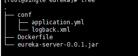
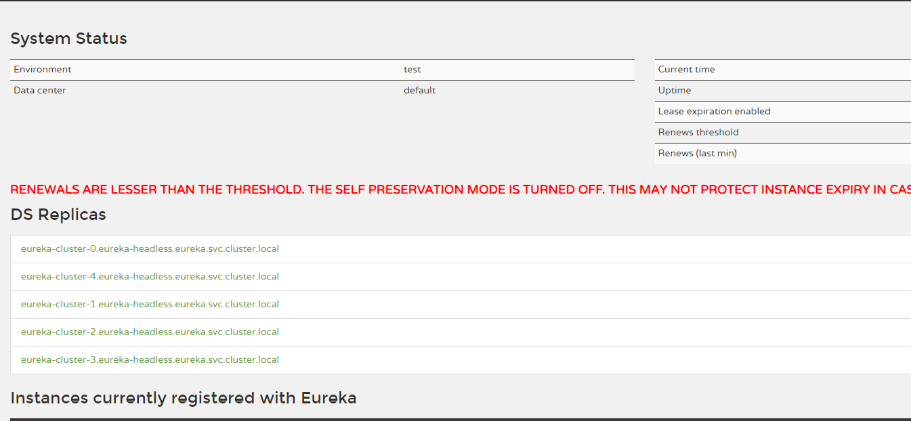

## 构建eureka镜像

```dockerfile
FROM adoptopenjdk/openjdk11:x86_64-alpine-jre-11.0.13_8
MAINTAINER <lhstack@foxmail.com>
ENV JAVA_OPTS="-Xmx128m -Xms128m"
EXPOSE 8761
RUN mkdir -p /eureka/conf
ADD eureka-server-0.0.1.jar /eureka/app.jar
COPY conf /eureka/conf
WORKDIR /eureka
CMD java $JAVA_OPTS -Dserver.port=8761 -jar app.jar
```

## 目录结构如下



`其中conf目录可以看作为classpath目录,可以放classpath的一些资源`

```shell
# 构建镜像
docker build -t eureka:11-alpine .
# 导出镜像
docker save -o eureka.tar eureka:11-alpine
# 导入镜像
docker import eureka.tar
```
## eureka.yaml
```yaml
apiVersion: v1
kind: Namespace
metadata:
  name: eureka
---
apiVersion: v1
kind: Service
metadata:
  name: eureka-headless
  namespace: eureka
spec:
  type: ClusterIP
  clusterIP: None
  selector:
    app: eureka
  ports:
    - name: http
      port: 8761
---
apiVersion: v1
kind: Service
metadata:
  name: eureka
  namespace: eureka
spec:
  type: ClusterIP
  ports:
    - name: http
      port: 8761
  selector:
    app: eureka
  clusterIP: 10.43.87.61
---
apiVersion: apps/v1
kind: StatefulSet
metadata:
  name: eureka-cluster
  namespace: eureka
spec:
  replicas: 5
  serviceName: eureka-headless
  selector:
    matchLabels:
      app: eureka
  template:
    metadata:
      labels:
        app: eureka
    spec:
      containers:
        - name: eureka
          image: eureka:11-alpine
          ports:
            - name: http
              containerPort: 8761
          env:
            - name: IS_STATEFUL_SET # 是否是statefulSet，这里需要设置，不然不会自动发现服务
              value: "true"
            - name: NAMESPACE # 命名空间，这里自建的eureka集群属于eureka命名空间，不写默认使用default
              value: "eureka"
            - name: SECURITY_ENABLE # 开启认证
              value: "true"
            - name: SECURITY_USERNAME # 认证用户
              value: "admin"
            - name: SECURITY_PASSWORD # 认证密码
              value: "654321"
            - name: SERVICE_NAME
              value: "eureka-headless" # 无头服务，和service里面的ClusterIP: None的那个服务的名称一致
            - name: REPLICAS
              value: "5" #集群数量，必须和replicas一致
            - name: JAVA_OPTS # eureka jvm启动参数
              value: "-Xmx128m -Xms64m"
          resources:
            requests:
              cpu: 50m
              memory: 128Mi
            limits:
              cpu: 100m
              memory: 288Mi
          readinessProbe:
            httpGet:
              path: /actuator/health
              port: 8761
            initialDelaySeconds: 5
            failureThreshold: 5
            periodSeconds: 5
            successThreshold: 1
            timeoutSeconds: 2
          livenessProbe:
            httpGet:
              path: /actuator/health
              port: 8761
            initialDelaySeconds: 60
            failureThreshold: 5
            periodSeconds: 120
            successThreshold: 1
            timeoutSeconds: 2
```
## 安装集群
```shell
kubectl apply -f eureka.yaml
```
## 成功界面如下
